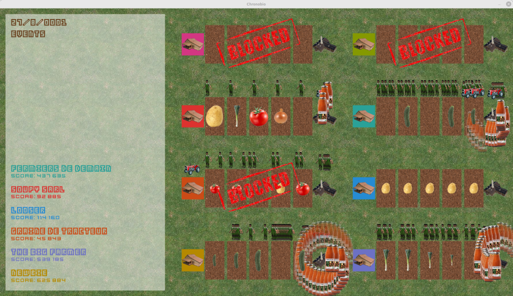

# Chronobio

## But du jeu

- Dominer le monde ! Devenir le meilleur producteur de soupe bio, en cultivant des légumes, en fabriquant des soupes, en les vendant.
- Cultivez plusieurs sortes de légumes : pomme de terre, poireau…
- Employez des ouvriers.
- Négociez avec la banque.
- Subissez l’économie de marché.
- Attention aux aléas climatiques.
- Ne faites pas banqueroute.



Le record du monde a été établi par l’équipe des Aigrisculteurs, avec un score de 8 426 796.


## Communication

### Échanges

À chaque début de tour de jeu (un tour de jeu équivaut à un jour), un dictionnaire en JSON avec les informations sur le jeu et toutes les fermes en exploitation est envoyé.

Chaque ferme doit envoyer au moins une commande (dont la syntaxe est détaillée ensuite) par jour de jeu.

### Début du jeu

Une exploitation démarre sans culture, et avec un apport financier initial de 100 000 euros. Le jeu dure 5 ans (en temps simulé).

### Chaque jour

L’exploitation reçoit les aides pour les exploitations biologiques : 5  euros par champ cultivé accompagnés de 30 euros pour l’exploitation.

Attention, il est possible de mécaniser l’exploitation agricole, mais chaque tracteur (y compris ceux des autres joueurs) émet des gaz à effets de serre. Plus la quantité de gaz émise depuis le début du jeu est importante, plus la probabilité qu’un évènement climatique se déclenche augmente. Nous risquons :

- canicules : les champs doivent être arrosés 2 fois plus que prévu initialement,
- grêle, ou gel : la culture des champs est détruite,
- inondations : la production de soupe est arrêtée 20 jours. Si la production est déjà arrêtée, les 20 jours s’ajoutent au temps d’arrêt actuel,
- incendies : la culture des champs est détruite, la production de soupe est arrêtée 40 jours. Si la production est déjà arrêtée, les 40 jours s’ajoutent au temps d’arrêt actuel.

Chaque champ ou usine a un risque sur deux d’être touché par un événement climatique lorsqu’il se produit.

### Déplacement

Lorsqu’un employé se déplace à pied, il peut se déplacer d’un lieu au lieu adjacent. S’il veut aller plus loin, il mettra un jour supplémentaire à chaque lieu traversé.

Lorsqu’un employé se déplace en tracteur, il peut se déplacer d’un lieu à un lieu adjacent, le lieu suivant ou encore le lieu d’après. S’il veut aller plus loin, il mettra un jour supplémentaire pour chaque trois lieus traversés.

Pour monter dans un tracteur, un employé doit se déplacer jusqu’au tracteur. S’il est déjà sur le même lieu, il peut directement monter dans le tracteur.

La carte d’une exploitation est la suivante :

- La ferme où sont livrés les tracteurs et où les employés sont embauchés
- Le champ 1
- Le champ 2
- Le champ 3
- Le champ 4
- Le champ 5
- L’usine à soupe

### Actions possibles

Il faut envoyer une ligne par action.
Chaque employé peut réaliser au maximum une action par jour.

Les champs entre accolades sont à remplacer par leurs valeurs.

- `{GÉRANT}` : numéro du gérant (0)
- `{OUVRIER}` : numéro de l’ouvrier (supérieur ou égal à 1)
- `{LÉGUME}` : un légume parmi `PATATE`, `POIREAU`, `TOMATE`, `OIGNON`, `COURGETTE`
- `{CHAMP}` : numéro du champ (de 1 à 5)
- `{SOMME}` : un montant entier en euros
- `{TRACTEUR}` : numéro du tracteur (supérieur ou égal à 1)

#### Acheter un champ

`{GÉRANT} ACHETER_CHAMP`

Un nouveau champ est acheté, 10 000 euros est enlevé du solde. Le premier champ qui sera acheté sera le champ 1. Si le champ 1 est déjà acheté, la tentative d’achat se portera sur le prochain champ disponible, dans l’ordre des numéros de champs.

#### Semer

`{OUVRIER} SEMER {LÉGUME} {CHAMP}`

Semer sur un champ préalablement acheté remplace la culture existante sur le champ.

#### Arroser

`{OUVRIER} ARROSER {CHAMP}`

Il faut normalement arroser au moins 10 fois un champ avant qu’il soit récoltable. Mais attention aux aléas climatiques.

#### Vendre des légumes

`{GÉRANT} VENDRE {CHAMP}`

Les légumes du champ ne peuvent être vendus que si, au début de la journée, le champ ne nécessite plus d’arrosage.

Les légumes sont vendus après récolte, la récolte dure deux jours : le gérant ne pourra pas faire d’action aux deux prochains jours.

Les légumes sont vendus au prix du marché, c’est-à-dire que la récolte est vendue pour la somme de 3 000 euros - 50 fois le nombre d’autres champs cultivant au moment de la vente la même espèce de légume en comptant toutes les fermes.

Un champ peut être impacté par un aléa climatique pendant les deux jours que prend la récolte. La vente sera alors ignorée/annulée.

#### Acheter un tracteur

`{GÉRANT} ACHETER_TRACTEUR`

Un tracteur coute 30 000 euros. Un tracteur émet 100 kg eqCO₂ par mois.

On ne peut pas acheter plus de 50 tracteurs dans une partie.

#### Stocker des légumes

`{OUVRIER} STOCKER {CHAMP} {TRACTEUR}`

Les légumes du champ ne peuvent être stockés que si, au début de la journée, le champ ne nécessite plus d’arrosage.

Les légumes du champ récoltable sont stockés dans l’usine de fabrication de soupe.

Après le transport, le stock de l’usine est augmenté de 2000 pour l’espèce de légume du champ.

#### Fabriquer des soupes et les vendre

`{OUVRIER} CUISINER`

Un ouvrier fabrique chaque jour 100 soupes si les ingrédients sont disponibles. Pour chaque soupe, il piochera dans les stocks de l’usine. Il essaiera de mettre le plus grand nombre de légumes différents dans une soupe.

La soupe est vendue :

- 1 euros la soupe de 1 légume
- 2 euros la soupe de 2 légumes
- 4 euros la soupe de 3 légumes
- 6 euros la soupe de 4 légumes
- 8 euros la soupe de 5 légumes

Les soupes sont livrées automatiquement au magasin qui s’occupe de tout (transport, vente aux clients finaux).

#### Employer un ouvrier

`{GÉRANT} EMPLOYER`

Le gérant emploie en CDI un ouvrier supplémentaire. Un employé est payé 1 000 euros le premier mois (tous les mois font 30 jours !). Chaque mois, il est augmenté de 1 % (l’augmentation est arrondie à l’entier supérieur). L’employé est payé le premier jour du mois, pour le travail du mois précédent (salaire complet même si le salarié n’a pas travaillé un mois complet).

On ne peut pas employer plus de 300 personnes dans une partie.

#### Licencier un ouvrier

`{GÉRANT} LICENCIER {OUVRIER}`

Le gérant se sépare d’un ouvrier (c’est un plan de sauvegarde de l’emploi…). Le gérant doit payer une indemnité de licenciement égale au salaire du prochain mois de l’ouvrier. Cela vient en surplus du salaire normal au pro rata du temps travaillé dans le mois.

#### Emprunter

`{GÉRANT} EMPRUNTER {SOMME}`

Le gérant emprunte une somme à la banque. Un emprunt dure 2 ans. La somme à rembourser est la somme empruntée multipliée par 1,10 soit environ 5 % par an. Cette somme est remboursée à parts égales chaque mois de l’emprunt.

La somme empruntée doit être positive et inférieure à 1 000 000 000.

Au maximum 10 emprunts peuvent être faits lors d’une partie.

## Conditions de victoire ou défaite

La victoire se décide à la fin des 5 ans de simulation.

- Une action invalide entraîne le blocage du joueur : il ne peut plus faire d’actions jusqu’à la fin du jeu.
- Un achat sans l’argent disponible entraîne le blocage du joueur.
- Un joueur ne pouvant pas payer ses dépenses est bloqué.
- Le joueur ayant le plus d’argent disponible à la fin (coût total des emprunts déduits) gagne.

## Comment jouer

- Créez un dépôt privé, en me donnant les accès (au moins en lecture, https://github.com/vpoulailleau)
- Créez un client pour vous connecter au serveur de jeu
  - En vous inspirant de l’exemple fourni
  - Votre projet devra pouvoir être lancé en ligne de commande (avec `argparse`)
    - `-a` : adresse IP du serveur
    - `-p` : port du serveur
    - Commencez par faire un code le plus basique possible qui se connecte au serveur (genre il achète un champ, puis plus aucune action), puis faites les étapes ci-dessous, et enfin améliorez votre code.
  - Votre projet devra contenir au moins une documentation minimaliste pour permettre à l’utilisateur d’installer et d’utiliser votre logiciel
- Mettez en place de l’intégration continue
  - Tests (`pytest`) automatiques (`GitHub actions`) avec mesure de couverture de test (qui doit avoisiner 100 %)
  - Qualimétrie (avec `flake8` et des plugins, ou `ruff`) pour faire un logiciel de bon niveau de qualité
  - Vérification des annotations de type (avec `mypy`)
  - Avec les mesures de couverture, qualimétrie et annotations de type, faites en sorte de refuser une pull request qui abaisserait le niveau de qualité de votre logiciel
- Éventuellement, mettez en place des hooks de pré-commit (https://pre-commit.com/)
- Codez votre stratégie
  - Partez d’abord sur une stratégie simpliste : cultivez des légumes sur un champ et vendez-les
  - Assurez-vous, tout le long du projet, de maintenir un niveau élevé de qualité (couverture de test proche de 100 %, rapport de linter sans erreur, annotations de type vérifiées)
  - Améliorez votre stratégie : utilisez tous les champs, optimisez votre production de légumes, utilisez des tracteurs, fabriquez de la soupe

## Auto-évaluation

Voici un barème pour évaluer le projet :

| Critère                                                                       | Points |
| ----------------------------------------------------------------------------- | ------ |
| Projet lançable en ligne de commande                                          | 0,5    |
| Documentation (installation des dépendances, lancement)                       | 1      |
| Acheter un champ                                                              | 0,5    |
| Acheter un tracteur                                                           | 0,5    |
| Employer                                                                      | 0,5    |
| Semer                                                                         | 1      |
| Arroser                                                                       | 1      |
| Vendre des légumes                                                            | 1      |
| Stocker                                                                       | 1,5    |
| Cuisiner                                                                      | 1      |
| Licencier                                                                     | 1      |
| Emprunter                                                                     | 0,5    |
| Écriture de tests (`pytest`)                                                  | 2      |
| Mesure de la couverture de test                                               | 1      |
| Pourcentage de couverture de test                                             | 2      |
| Qualimétrie (`flake8` et plugins)                                             | 1      |
| GitHub action                                                                 | 1      |
| Refus de pull request / push si baisse de couverture ou qualité               | 1      |
| Classement compétition                                                        | 2      |
| Bonus (pré-commit, annotations de type, vérification des annotations de type) | 3      |

## Commandes

### Installation

```shell
python3.11 -m venv venv
. venv/bin/activate
# pour jouer
pip install --upgrade chronobio
# pour développer
pip install --upgrade chronobio[dev]
```

### Lancer le jeu

```shell
# Dans un environnement virtuel activé

# choisir un port non utilisé
PORT=12345
# lancer le serveur
python -m chronobio.game.server -p $PORT &
# lancer le viewer
python -m chronobio.viewer -p $PORT &
# lancer un joueur
python -m mon_code -p $PORT
```

### Terminer tous les programmes lancés

```shell
# Pour Linux et Mac, dans un environnement virtuel activé
python -m chronobio.killall
```

### Publier

```shell
python -m build
python -m twine upload dist/*
```
